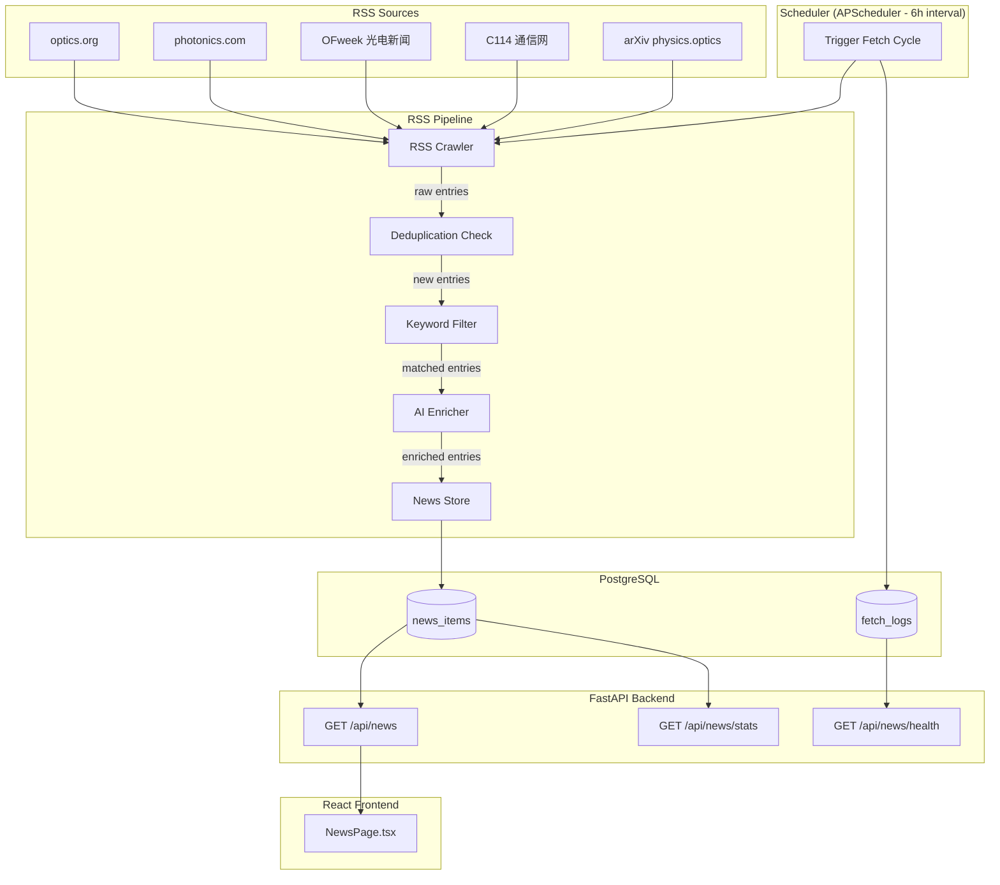

# Design Document: Auto News RSS Aggregation System

## Overview

This design describes the automatic RSS news aggregation system for the 光芯云 PhotonCloud platform. The system replaces the current static mock news data (`src/data/newsData.ts` with localStorage) with a fully automated pipeline that crawls photonics industry RSS feeds, filters relevant content via keyword matching, enriches entries with AI-generated classifications and Chinese summaries, persists results to PostgreSQL, and serves them through a REST API consumed by the existing React frontend.

The pipeline runs on a 6-hour schedule and supports 5 RSS sources spanning English and Chinese photonics media. The architecture is designed for reliability with per-source error isolation, deduplication by source URL, and graceful AI fallback.

## Architecture

### System Data Flow



### Design Decisions

| Decision | Choice | Rationale |
|----------|--------|-----------|
| Scheduler | APScheduler (in-process) | Lightweight; no external dependency like Celery/Redis; sufficient for 6h interval |
| RSS Parsing | feedparser | Mature, handles RSS 2.0 and Atom feeds, tolerant of malformed XML |
| AI Provider | OpenAI API (gpt-4o-mini) | Good multilingual support, JSON mode for structured output, cost-effective |
| ORM | SQLAlchemy 2.0 + asyncpg | Async PostgreSQL support, aligns with FastAPI async patterns |
| Migration | Alembic | Standard SQLAlchemy migration tool |
| Frontend data fetching | Native fetch + React state | Minimal dependency addition; the project doesn't use a heavy state library |

## Components and Interfaces

### Backend Module Structure

```
backend/
├── main.py                      # Existing: add news router inclusion
├── app/
│   ├── core/
│   │   ├── config.py            # Environment variables and settings
│   │   └── database.py          # SQLAlchemy async engine and session
│   ├── models/
│   │   └── news.py              # SQLAlchemy ORM models
│   ├── routers/
│   │   └── news.py              # News API endpoints
│   ├── services/
│   │   ├── rss_crawler.py       # RSS feed fetching and parsing
│   │   ├── keyword_filter.py    # Photonics keyword matching
│   │   ├── ai_enricher.py       # AI classification and summary generation
│   │   ├── news_store.py        # Database CRUD operations
│   │   └── scheduler.py         # APScheduler setup and pipeline orchestration
│   └── __init__.py
├── alembic/                     # Database migrations
│   ├── alembic.ini
│   └── versions/
└── requirements.txt             # Updated with new dependencies
```

### Component Interfaces

#### 1. RSS Crawler (`rss_crawler.py`)

```python
@dataclass
class RawEntry:
    title: str
    link: str
    published: datetime | None
    summary: str
    source_name: str
    source_url: str

class RSSCrawler:
    def __init__(self, sources: list[RSSSource]):
        ...

    async def fetch_all(self) -> tuple[list[RawEntry], list[FetchError]]:
        """Fetch entries from all configured sources.
        Returns (entries, errors) — errors are isolated per source."""
        ...

    async def fetch_source(self, source: RSSSource) -> list[RawEntry]:
        """Fetch and parse a single RSS source. Raises on failure."""
        ...
```

#### 2. Keyword Filter (`keyword_filter.py`)

```python
class KeywordFilter:
    def __init__(self, keywords: list[str]):
        ...

    def matches(self, entry: RawEntry) -> bool:
        """Check if entry title or summary matches any keyword.
        English: case-insensitive whole-word or substring match.
        Chinese: substring match."""
        ...

    def filter_entries(self, entries: list[RawEntry]) -> tuple[list[RawEntry], list[RawEntry]]:
        """Returns (matched, discarded) entries."""
        ...
```

#### 3. AI Enricher (`ai_enricher.py`)

```python
@dataclass
class EnrichedEntry:
    title: str
    link: str
    published: datetime | None
    summary_zh: str            # Chinese summary, 50-150 chars
    source_name: str
    source_url: str
    category: str              # one of: industry, research, policy, funding, product, standard
    region: str                # one of: global, china, us, europe, japan, korea
    chip_tags: list[str]       # e.g. ["CPO", "Silicon Photonics"]
    importance: str            # "high" | "medium"

class AIEnricher:
    def __init__(self, api_key: str, model: str = "gpt-4o-mini"):
        ...

    async def enrich(self, entry: RawEntry) -> EnrichedEntry:
        """Classify, summarize, and tag a single entry.
        Falls back to defaults on AI failure."""
        ...

    async def enrich_batch(self, entries: list[RawEntry]) -> list[EnrichedEntry]:
        """Process entries concurrently with rate limiting."""
        ...
```

#### 4. News Store (`news_store.py`)

```python
class NewsStore:
    def __init__(self, session_factory):
        ...

    async def exists_by_url(self, source_url: str) -> bool:
        """Check if an entry with this source URL already exists."""
        ...

    async def save_entry(self, entry: EnrichedEntry) -> str:
        """Persist enriched entry, return generated ID."""
        ...

    async def query(
        self,
        category: str | None = None,
        region: str | None = None,
        tag: str | None = None,
        page: int = 1,
        page_size: int = 20,
    ) -> tuple[list[NewsItemRow], int]:
        """Query news with filters and pagination. Returns (items, total_count)."""
        ...

    async def get_stats(self) -> dict:
        """Aggregated stats: total count, per-category counts, per-region counts."""
        ...
```

#### 5. Scheduler (`scheduler.py`)

```python
class NewsScheduler:
    def __init__(self, crawler, filter, enricher, store):
        ...

    async def run_pipeline(self) -> FetchCycleResult:
        """Execute full pipeline: crawl → deduplicate → filter → enrich → store.
        Logs summary and updates system health status."""
        ...

    def start(self):
        """Register APScheduler job (interval=6 hours)."""
        ...

    def get_health(self) -> HealthStatus:
        """Return last cycle result and system status."""
        ...
```

#### 6. News API Router (`routers/news.py`)

| Endpoint | Method | Parameters | Response |
|----------|--------|-----------|----------|
| `/api/news` | GET | `category`, `region`, `tag`, `page`, `page_size` | Paginated `NewsItem[]` |
| `/api/news/stats` | GET | — | `{total, by_category, by_region}` |
| `/api/news/health` | GET | — | `{status, last_fetch, entry_count}` |

## Data Models

### PostgreSQL Schema

```sql
-- News items table
CREATE TABLE news_items (
    id UUID PRIMARY KEY DEFAULT gen_random_uuid(),
    title VARCHAR(500) NOT NULL,
    summary VARCHAR(500) NOT NULL,
    source_name VARCHAR(100) NOT NULL,
    source_url VARCHAR(2000) NOT NULL UNIQUE,
    published_at TIMESTAMP WITH TIME ZONE,
    fetched_at TIMESTAMP WITH TIME ZONE NOT NULL DEFAULT NOW(),
    category VARCHAR(20) NOT NULL DEFAULT 'industry',
    region VARCHAR(20) NOT NULL DEFAULT 'global',
    chip_tags TEXT[] NOT NULL DEFAULT '{}',
    importance VARCHAR(10) NOT NULL DEFAULT 'medium',
    content_link VARCHAR(2000),
    created_at TIMESTAMP WITH TIME ZONE NOT NULL DEFAULT NOW(),

    CONSTRAINT chk_category CHECK (category IN ('industry', 'research', 'policy', 'funding', 'product', 'standard')),
    CONSTRAINT chk_region CHECK (region IN ('global', 'china', 'us', 'europe', 'japan', 'korea')),
    CONSTRAINT chk_importance CHECK (importance IN ('high', 'medium', 'low'))
);

-- Indexes for query performance
CREATE INDEX idx_news_published_at ON news_items(published_at DESC);
CREATE INDEX idx_news_category ON news_items(category);
CREATE INDEX idx_news_region ON news_items(region);
CREATE INDEX idx_news_chip_tags ON news_items USING GIN(chip_tags);
CREATE INDEX idx_news_source_url ON news_items(source_url);

-- Fetch cycle logs
CREATE TABLE fetch_logs (
    id SERIAL PRIMARY KEY,
    started_at TIMESTAMP WITH TIME ZONE NOT NULL,
    completed_at TIMESTAMP WITH TIME ZONE,
    sources_attempted INTEGER NOT NULL DEFAULT 0,
    sources_succeeded INTEGER NOT NULL DEFAULT 0,
    entries_found INTEGER NOT NULL DEFAULT 0,
    entries_passed_filter INTEGER NOT NULL DEFAULT 0,
    entries_stored INTEGER NOT NULL DEFAULT 0,
    errors JSONB DEFAULT '[]',
    status VARCHAR(20) NOT NULL DEFAULT 'running'
);

CREATE INDEX idx_fetch_logs_started ON fetch_logs(started_at DESC);
```

### SQLAlchemy ORM Model

```python
from sqlalchemy import Column, String, DateTime, Integer, ARRAY, text
from sqlalchemy.dialects.postgresql import UUID, JSONB
from sqlalchemy.orm import DeclarativeBase
import uuid

class Base(DeclarativeBase):
    pass

class NewsItem(Base):
    __tablename__ = "news_items"

    id = Column(UUID(as_uuid=True), primary_key=True, default=uuid.uuid4)
    title = Column(String(500), nullable=False)
    summary = Column(String(500), nullable=False)
    source_name = Column(String(100), nullable=False)
    source_url = Column(String(2000), nullable=False, unique=True)
    published_at = Column(DateTime(timezone=True))
    fetched_at = Column(DateTime(timezone=True), server_default=text("NOW()"))
    category = Column(String(20), nullable=False, default="industry")
    region = Column(String(20), nullable=False, default="global")
    chip_tags = Column(ARRAY(String), nullable=False, default=[])
    importance = Column(String(10), nullable=False, default="medium")
    content_link = Column(String(2000))
    created_at = Column(DateTime(timezone=True), server_default=text("NOW()"))

class FetchLog(Base):
    __tablename__ = "fetch_logs"

    id = Column(Integer, primary_key=True, autoincrement=True)
    started_at = Column(DateTime(timezone=True), nullable=False)
    completed_at = Column(DateTime(timezone=True))
    sources_attempted = Column(Integer, default=0)
    sources_succeeded = Column(Integer, default=0)
    entries_found = Column(Integer, default=0)
    entries_passed_filter = Column(Integer, default=0)
    entries_stored = Column(Integer, default=0)
    errors = Column(JSONB, default=[])
    status = Column(String(20), default="running")
```

### API Response Schema (matching existing `NewsItem` interface)

```typescript
// Response from GET /api/news — maps to existing frontend NewsItem interface
interface NewsItemResponse {
  id: string
  title: string
  summary: string
  source: string        // maps from source_name
  sourceUrl: string     // maps from source_url
  date: string          // ISO date from published_at
  category: 'industry' | 'research' | 'policy' | 'funding' | 'product' | 'standard'
  region: 'global' | 'china' | 'us' | 'europe' | 'japan' | 'korea'
  chipTags: string[]    // maps from chip_tags
  importance: 'high' | 'medium' | 'low'
  content: string       // empty string or fetched content
}

interface PaginatedResponse {
  items: NewsItemResponse[]
  total: number
  page: number
  page_size: number
  total_pages: number
}
```

### Configuration (Environment Variables)

| Variable | Default | Description |
|----------|---------|-------------|
| `DATABASE_URL` | `postgresql+asyncpg://photoncloud:password@db:5432/photoncloud` | Async PostgreSQL connection string |
| `OPENAI_API_KEY` | — (required) | OpenAI API key for AI enrichment |
| `OPENAI_MODEL` | `gpt-4o-mini` | Model for classification/summary |
| `RSS_FETCH_INTERVAL_HOURS` | `6` | Interval between fetch cycles |
| `RSS_FETCH_TIMEOUT_SECONDS` | `30` | HTTP timeout per RSS source |
| `NEWS_PAGE_SIZE_MAX` | `100` | Maximum allowed page_size parameter |
| `NEWS_RETENTION_DAYS` | `365` | Days before archival |

### RSS Source Configuration

```python
RSS_SOURCES = [
    RSSSource(name="Optics.org", url="https://optics.org/rss", language="en"),
    RSSSource(name="Photonics.com", url="https://www.photonics.com/RSS", language="en"),
    RSSSource(name="OFweek 光电新闻", url="https://www.ofweek.com/rss/news.xml", language="zh"),
    RSSSource(name="C114 通信网", url="https://www.c114.com.cn/rss.xml", language="zh"),
    RSSSource(name="arXiv physics.optics", url="http://arxiv.org/rss/physics.optics", language="en"),
]
```


## Correctness Properties

*A property is a characteristic or behavior that should hold true across all valid executions of a system — essentially, a formal statement about what the system should do. Properties serve as the bridge between human-readable specifications and machine-verifiable correctness guarantees.*

### Property 1: RSS feed parsing extracts all required fields

*For any* valid RSS/Atom XML document containing entries with title, link, publication date, and summary elements, parsing the document SHALL produce `RawEntry` objects where each field is non-empty and the publication date is a valid datetime.

**Validates: Requirements 1.2**

### Property 2: Error isolation — failed sources do not block others

*For any* set of configured RSS sources where a subset fails (network error, parse error, timeout), the crawler SHALL return successful results from all non-failing sources and error records for each failing source.

**Validates: Requirements 1.4**

### Property 3: Deduplication by source URL

*For any* list of fetched entries where some source URLs already exist in the database, the pipeline SHALL store only entries whose source URLs are not already present, and the count of newly stored entries SHALL equal the count of entries with novel URLs.

**Validates: Requirements 1.5**

### Property 4: Keyword filter is a complete partition

*For any* entry (title, summary) and the configured keyword list, the entry is matched if and only if at least one keyword appears in the title or summary (case-insensitive for English keywords, substring match for Chinese keywords). Matched entries proceed to enrichment; unmatched entries are discarded.

**Validates: Requirements 2.1, 2.3, 2.4**

### Property 5: AI enrichment produces valid structured output

*For any* entry processed by the AI enricher, the result SHALL have: exactly one category from {industry, research, policy, funding, product, standard}, exactly one region from {global, china, us, europe, japan, korea}, and a chip_tags field that is a (possibly empty) list of strings.

**Validates: Requirements 3.1, 3.4**

### Property 6: AI summary length constraint

*For any* entry processed by the AI enricher (when AI is available), the generated Chinese summary SHALL be between 50 and 150 characters in length.

**Validates: Requirements 3.2**

### Property 7: AI enrichment graceful fallback

*For any* entry processed when the AI service is unavailable or returns an error, the stored entry SHALL have category="industry", summary equal to the original title, region="global", and an empty chip_tags list.

**Validates: Requirements 3.6**

### Property 8: News storage round-trip preservation

*For any* valid enriched entry, storing it to the database and then retrieving it by ID SHALL produce an entry with identical values for all fields (title, summary, source_name, source_url, category, region, chip_tags, importance).

**Validates: Requirements 4.1**

### Property 9: Query results satisfy all filter criteria

*For any* query with filter parameters (category, region, tag), every item in the response SHALL satisfy all specified filters: if category is specified, item.category must equal the filter value; if region is specified, item.region must equal the filter value; if tag is specified, item.chip_tags must contain the filter value.

**Validates: Requirements 4.3, 5.2**

### Property 10: Query results are sorted by publication date descending

*For any* paginated query result containing 2 or more items, the publication dates SHALL be in non-increasing order (each item's date ≥ next item's date).

**Validates: Requirements 5.1**

### Property 11: API response conforms to NewsItem interface

*For any* news item returned by the GET /api/news endpoint, the JSON response SHALL contain all required fields (id, title, summary, source, sourceUrl, date, category, region, chipTags, importance) with correct types: id and title and summary are non-empty strings, category is one of the 6 valid values, region is one of the 6 valid values, chipTags is an array of strings, importance is one of "high"/"medium"/"low".

**Validates: Requirements 5.3**

### Property 12: Invalid parameters produce HTTP 422

*For any* request to GET /api/news with invalid parameters (page < 1, page_size < 1, page_size > 100, category not in valid set, region not in valid set), the API SHALL return HTTP status code 422.

**Validates: Requirements 5.4**

### Property 13: Frontend filter selections produce correct API query parameters

*For any* combination of category and region filter selections in the UI, the fetch request to the backend SHALL include the corresponding query parameters matching the selected filter values.

**Validates: Requirements 6.5**

### Property 14: Fetch cycle log completeness

*For any* completed pipeline execution, a fetch_log record SHALL be created containing: sources_attempted ≥ 1, sources_succeeded ≤ sources_attempted, entries_found ≥ entries_passed_filter ≥ entries_stored ≥ 0, and a valid status value.

**Validates: Requirements 7.2**

## Error Handling

### RSS Crawler Errors

| Error Type | Handling | Recovery |
|-----------|----------|----------|
| Network timeout (per source) | Log error with timestamp and source name, skip source | Continue with remaining sources; retry on next cycle |
| XML parse error | Log malformed feed content snippet, skip source | Continue; may indicate source URL change |
| All sources fail | Mark system status as "degraded" | Retry after 30 minutes instead of waiting full 6 hours |

### AI Enricher Errors

| Error Type | Handling | Recovery |
|-----------|----------|----------|
| API rate limit (429) | Exponential backoff: 1s, 2s, 4s, 8s (max 3 retries) | After max retries, use fallback defaults |
| API timeout | 30-second timeout per request | Use fallback defaults for the entry |
| Invalid JSON response | Log raw response, use fallback defaults | Entry still stored with defaults |
| API key invalid (401) | Log critical error, stop enrichment batch | All remaining entries use fallback defaults; alert in health endpoint |

### Fallback Default Values

When AI enrichment fails for an entry:
- `category`: "industry"
- `summary`: original entry title (truncated to 150 chars)
- `region`: "global"  
- `chip_tags`: `[]`
- `importance`: "medium"

### Database Errors

| Error Type | Handling | Recovery |
|-----------|----------|----------|
| Connection failure | Retry with exponential backoff (3 attempts) | Log error; pipeline marks cycle as failed |
| Unique constraint violation (source_url) | Silently skip — entry already exists | Normal operation (deduplication) |
| Disk full / write failure | Log critical error | Mark health as "error"; alert admin |

### Frontend Error States

| Scenario | UI Behavior |
|----------|-------------|
| API unreachable | Show error message with retry button; preserve any cached data |
| Slow response (>5s) | Show loading skeleton; no timeout on frontend |
| Empty results (after filter) | Show "该筛选条件下暂无内容" message (existing pattern) |
| Partial page load failure | Show loaded items; indicate load-more failed with retry |

## Testing Strategy

### Property-Based Testing

**Library**: Hypothesis (Python) for backend properties, fast-check (TypeScript) for frontend property 13.

**Configuration**: Each property test runs minimum 100 iterations with randomized inputs.

**Tag format**: Each test includes a comment referencing its design property:
```python
# Feature: auto-news-rss, Property 4: Keyword filter is a complete partition
```

**Backend properties to implement** (Properties 1-12, 14):
- Property 1: Generate random RSS XML → verify parsing extracts all fields
- Property 2: Mock sources with random failure subsets → verify isolation
- Property 3: Seed DB with random existing URLs → verify only novel ones stored
- Property 4: Generate random (title, summary) pairs with/without keywords → verify match/reject
- Property 5: Mock AI responses → verify validation produces valid structured output
- Property 6: Mock AI summaries of varying length → verify constraint enforcement
- Property 7: Simulate AI failure → verify fallback values
- Property 8: Generate random EnrichedEntry → store → retrieve → compare
- Property 9: Seed DB with random entries → apply random filters → verify all results match
- Property 10: Seed DB → query → verify date ordering
- Property 11: Query API → validate response schema
- Property 12: Generate random invalid params → verify 422
- Property 14: Run pipeline → verify log record invariants

**Frontend property to implement** (Property 13):
- Select random filter combinations → verify fetch URL params

### Unit Tests (Example-Based)

- RSS source configuration includes all 5 required sources (Req 1.3)
- Keyword list contains all specified minimum keywords (Req 2.2)
- AI summary is in Chinese for English-language entries (Req 3.3)
- Stats endpoint returns correct aggregation (Req 5.5)
- Health endpoint returns expected structure (Req 7.3)
- System marks "degraded" on all-source failure (Req 7.4)
- Frontend shows loading state during fetch (Req 6.2)
- Frontend shows error + retry on API failure (Req 6.3)
- Frontend supports pagination/infinite scroll (Req 6.4)

### Integration Tests

- End-to-end pipeline: mock RSS feeds → DB → API → verify response
- Database migration applies cleanly on fresh PostgreSQL
- Scheduler starts on application startup and fires at interval
- Frontend fetches from API instead of localStorage (Req 6.1)

### Test Infrastructure

```
backend/tests/
├── conftest.py              # Fixtures: test DB, mock HTTP, mock OpenAI
├── test_rss_crawler.py      # Properties 1, 2 + unit tests
├── test_keyword_filter.py   # Property 4 + unit tests
├── test_ai_enricher.py      # Properties 5, 6, 7 + unit tests
├── test_news_store.py       # Properties 3, 8, 9, 10 + unit tests
├── test_news_api.py         # Properties 11, 12, 14 + integration
└── test_scheduler.py        # Pipeline orchestration tests

src/__tests__/
└── NewsPage.test.tsx        # Property 13 + UI unit tests
```

### Dependencies for Testing

**Backend** (add to `requirements-dev.txt`):
```
pytest>=7.4.0
pytest-asyncio>=0.21.0
hypothesis>=6.82.0
httpx>=0.24.0
pytest-httpserver>=1.0.0
factory-boy>=3.3.0
```

**Frontend** (add to `devDependencies`):
```json
{
  "vitest": "^1.0.0",
  "@testing-library/react": "^14.0.0",
  "fast-check": "^3.15.0",
  "msw": "^2.0.0"
}
```
